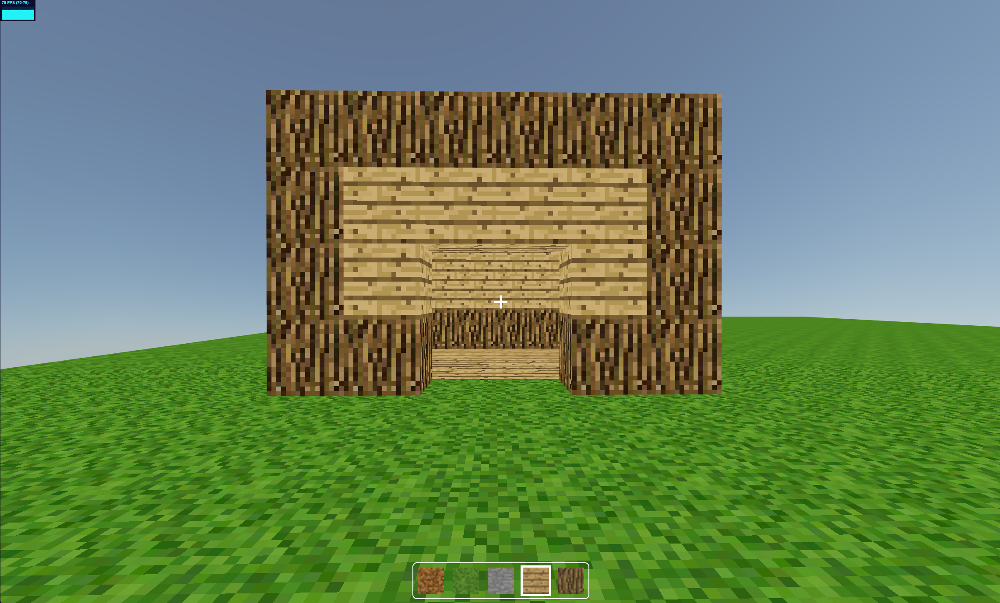

# MC-Clone

Simple Minecraft clone made using React and `react-three-fiber`

Live version: [mc-clone.critteros.dev](https://mc-clone.critteros.dev)



**Note:** For the best visual experience, it's recommended to view this app on Chrome as Firefox may display overly saturated shading.

## Run project locally

Mise is used to manage node version, make sure it is installed or use the node version specified in `.nvmrc`

```bash
mise install
```

Package manager is selected using `corepack`, make sure it is enabled for the current node version

```bash
corepack enable
corepack install
```

Install dependencies

```bash
pnpm install
```

Run the project

```bash
pnpm dev
```